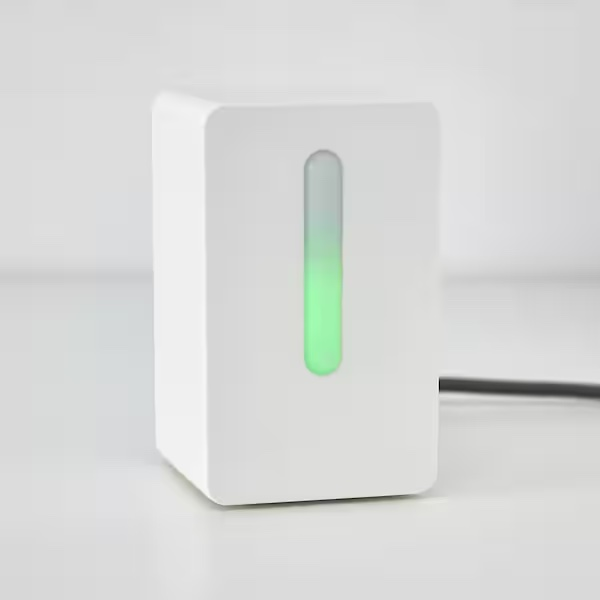
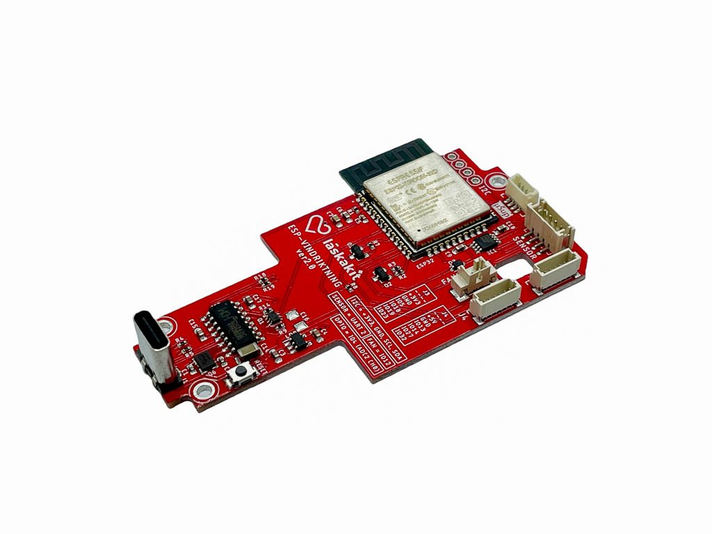

<div align="center">
<h1> ESP (Ikea) Vindriktning & Rust 🦀</h1>

Upgraded Ikea Vindriktning with ESP32

  

&plus;

  
</div>

### Basic features

- Air quality monitoring (PM2.5 + CO2)
- Smart LEDs for displaying results
- Simple HTTP server (over WiFi) for various stuff (_work in-progress_)

## Lifecycle

1. turn on the fan for 10 seconds to get fresh air
2. measure C02 & PM2.5
3. sleep for 50 seconds
4. repeat

## REST API

TODO

## Components

- IKEA Vindriktning https://www.ikea.com/cz/cs/p/vindriktning-senzor-kvality-vzduchu-80515910/
- ESP32 board https://www.laskakit.cz/laskakit-esp-vindriktning-esp-32-i2c/
- SCD41 CO2 sensor https://www.laskakit.cz/laskakit-scd41-senzor-co2--teploty-a-vlhkosti-vzduchu/

## Development

1. Install `espup` (https://github.com/esp-rs/espup#installation)

```
cargo install espup
```

2. Install toolchains

```
espup install --esp-idf-version 4.4
```

3. Set up the environment variables running: `source ~/export-esp.sh`. **This step must be done every time you open a new terminal.**

4. To make this work with `rust-analyzer`, edit `.vscode/settings.json` like this:

```
  "rust-analyzer.server.extraEnv": {
    "LIBCLANG_PATH": "the same path as in ~/export-esp.sh, has to be absolute"
  },
```

## Flashing

```
make flash
```

## Notes

- binary larger than 1 MB won't flash without `partition.csv` file (1MB is probably a default value)

- `opt-level = "s"` is currenty broken in `rustc 1.65.0` (miscompilation issues)
